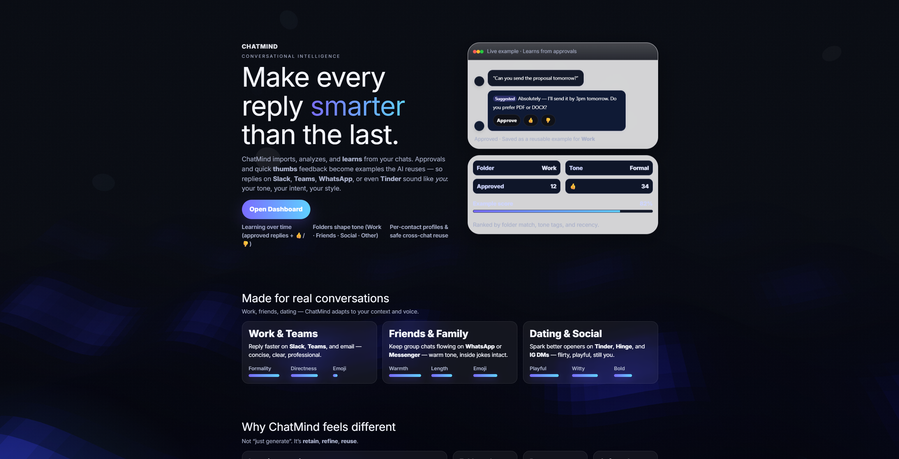
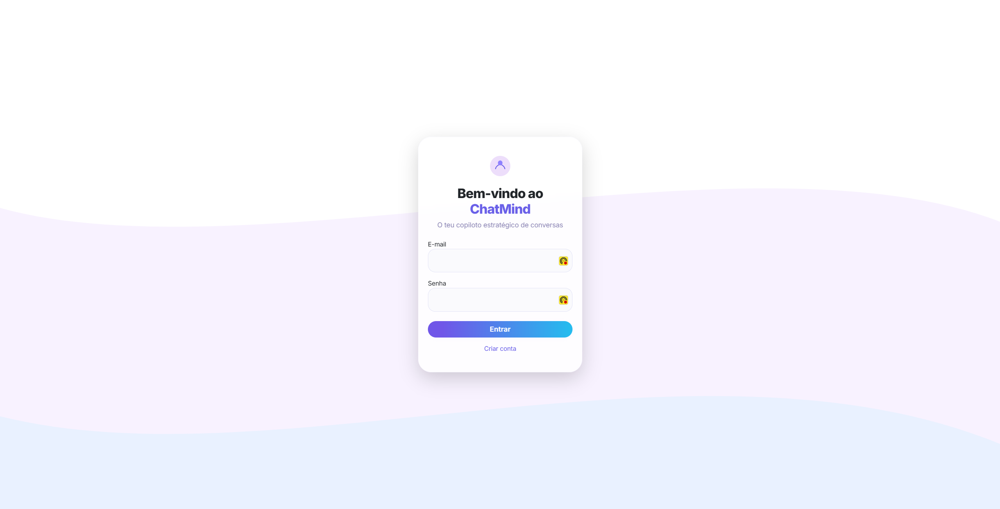
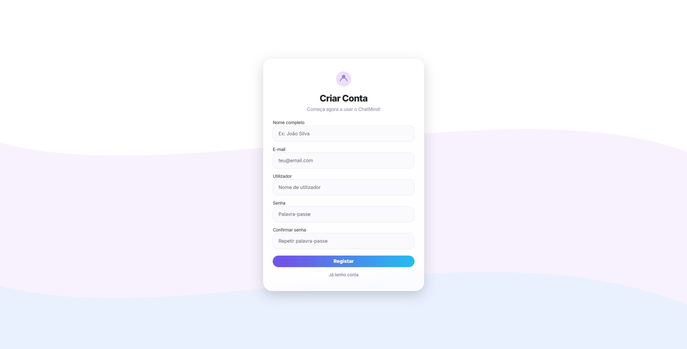
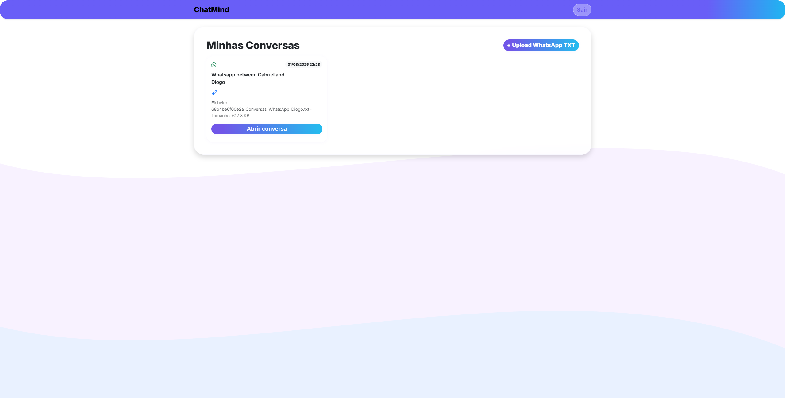
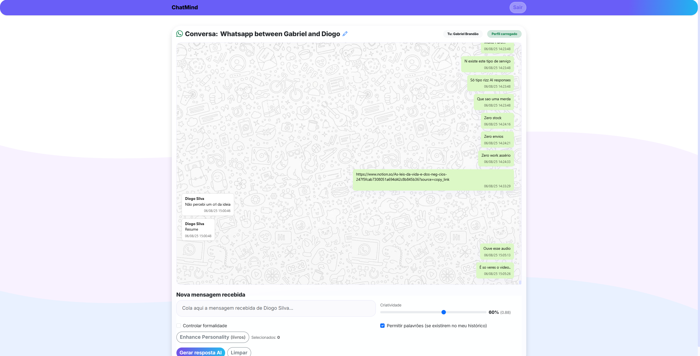
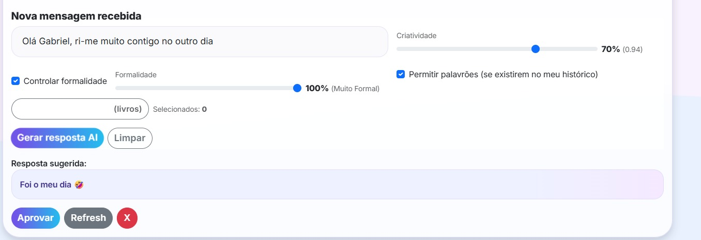
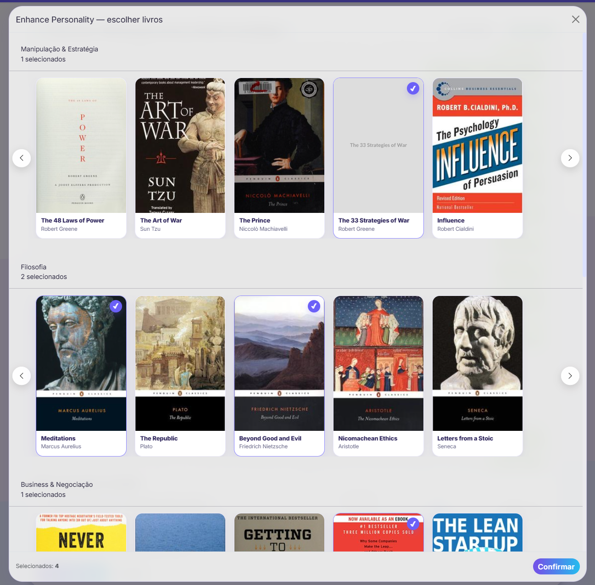

# 💬 ChatMind

> **ChatMind** - A local-first AI dashboard for importing, analyzing, and replying to your conversations.



---

## 📖 Overview

**ChatMind** is a web-based AI companion and productivity tool that imports, analyzes, summarizes, and interacts with chat conversations from different platforms.  
It runs on a **local LLM backend** (via `llama-cpp-python` or native binaries), ensuring **privacy, speed, and offline-first operation**.  

- Works today with historic `.txt` chat logs.  
- Roadmap includes **live integrations**: WhatsApp, Teams, Slack, Telegram, Messenger.  
- Vision: a **memory-aware assistant** that adapts tone and style, learns from past chats, and provides **context-rich replies** across all your conversations.

At import, ChatMind performs **profile and message analysis**: it detects tone, common phrases, and communication patterns in your chat history.  
When generating new messages, it tries to **mimic your personal voice and style**, gradually becoming a closer reflection of how *you* would reply.

---

## ✨ Current Features

- 🧬 **Profile & Message Analysis** – initial scan of conversations to extract tone, style, and recurring phrases  
- 🪞 **Style-Cloned Replies** – AI-generated messages aim to mirror your personal communication style  
- 📂 **Dashboard View** – list of imported conversations  
- ✏️ **Inline Renaming** – AJAX chat renames without reloads  
- 🗨️ **Conversation Viewer** – scrollable chat history  
- 🤖 **AI Reply Generator** – context-aware responses with one click  
- 🎚️ **Creativity Slider** – maps to LLM temperature  
- 🎭 **Formality Toggle** – control tone (formal vs casual)  
- 📎 **TXT File Import** – bring in historic conversations  
- 🔒 **Local-first AI** – works with any OpenAI-compatible LLM (LLaMA, Phi, Mistral)  
- 👤 **User Accounts** – login, registration, CSRF protection  
- 🎨 **UI Polish** – glassmorphism design, reveal-on-scroll animations, parallax effects  

---

## 📸 Project Features Showcase

| Feature | Screenshot |
|---------|------------|
| Login & Register |  |
| Register |  |
| Dashboard Overview |  |
| Conversation View |  |
| AI Reply Generator |  |
| Personality Enhancer (Books Module) |  |

---

## 💡 Why ChatMind?

- 📂 **Centralize** chats from multiple platforms (WhatsApp, Slack, Teams, Messenger, Telegram, and more)  
- 🧬 **Profile & Message Analysis** – detects tone, phrasing, and style from your past conversations  
- 🪞 **Your Voice, Your Clone** – AI replies are generated in your personal style, mirroring how *you* would respond  
- 🤖 **Adaptive Learning** – improves over time with approved replies and tone tags, refining context and style consistency  
- 🔒 **Stay private** – runs 100% locally, no cloud data leaks  
- ⚡ **Extensible** – built for connectors, browser extensions, and future integrations  
- 🎯 **Memory-aware** – leverages conversation history and approved responses to deliver context-rich replies  

---

## 🚀 Roadmap

### 🔹 Memory & Adaptation
- [x] Approve & save AI replies per conversation  
- [~] Approved replies reused as few-shot prompts  
- [~] Tone tags on replies (friendly, formal, sarcastic, flirty)  
- [~] Cross-conversation knowledge sharing  
- [ ] Replay/simulation mode for accelerated style learning  

### 🔹 Organization & UX
- [~] Dashboard folders (Work, Friends, Social Life, Other)  
- [~] Drag & drop conversations into folders  
- [ ] Search & filter across conversations  
- [ ] Per-conversation profile & context toggles  

### 🔹 Personalization
- [ ] Profile survey (age, role, tone defaults, etc.)  
- [ ] Availability windows for simulating “being online”  
- [ ] Personality profiles per contact  

### 🔹 Integrations
- [ ] Live connectors: WhatsApp, Slack, Teams, Messenger, Telegram  
- [ ] Browser extension for direct approval/capture  
- [ ] Optional TTS / voice message generation  

---

## 🖥 Requirements

- PHP 7.4+ (tested with PHP 8+)  
- MySQL/MariaDB  
- XAMPP or similar local PHP+MySQL stack  
- Local LLM server (via `llama-cpp-python` or native binary)  
- Node/NPM if building advanced UI features  

---

## 📦 Installation

1. Clone the repository:

```bash
git clone https://github.com/bakill3/chatmind.git
cd chatmind
```

2. Import the database schema (see `db/chatmind.sql`) into MySQL.

3. Update `config.php` with your DB credentials if needed.

4. Ensure `uploads/` is writable:

```bash
chmod 755 uploads
```

5. Start your local PHP server via XAMPP or:
```bash
php -S 127.0.0.1:8000
```

## 🤖 Running the Local Model

### Option 1 - Windows Native (fastest if you have GPU layers enabled)

```powershell
cd /d C:\xampp\htdocs\chatmind\llama
.\llama-server.exe --model ".\Meta-Llama-3.1-8B-Instruct-Q4_K_M.gguf" ^
  --alias chatmind ^
  --ctx-size 8192 ^
  --n-gpu-layers 999 ^
  --host 127.0.0.1 ^
  --port 8080
```

### Option 2 - Cross-Platform via llama-cpp-python

#### macOS/Linux
```bash
bash scripts/setup_llama.sh
```

#### Windows PowerShell
```powershell
powershell -ExecutionPolicy Bypass -File scripts\setup_llama.ps1
```

This will:
- Create a `.venv` Python virtualenv
- Install `llama-cpp-python[server]`
- Download `Phi-3-mini-4k-instruct-q4.gguf`
- Run it as an OpenAI-compatible server on `127.0.0.1:8080`

## 🔧 Config

Key configuration is in `config.php`:

```php
define('LLAMA_API_URL', 'http://127.0.0.1:8080/v1/chat/completions');
define('LLAMA_MODEL_ID', 'chatmind');
define('LLAMA_TEMP', 0.8);
```

## 📜 License

See [LICENSE](LICENSE) for details.