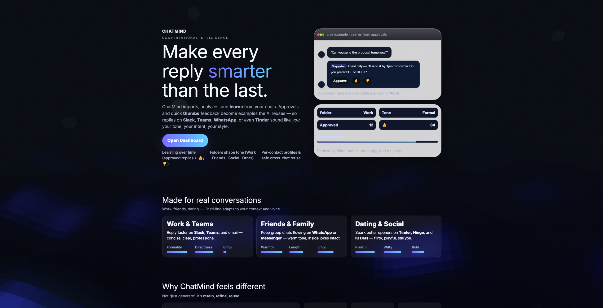

# 💬 ChatMind

> **ChatMind** — A local-first AI dashboard for importing, analyzing, and replying to your conversations.



---

## 📖 Overview

**ChatMind** is a web-based AI companion and productivity tool that imports, analyses, summarizes, and interacts with chat conversations from different platforms.  
It runs on a **local LLM backend** (OpenAI-compatible server wrappers such as `llama-cpp-python` or native binaries), ensuring **privacy, speed, and offline-first operation**.

- Works today with historic `.txt` chat logs (WhatsApp-style exports).
- Roadmap includes **live connectors** (WhatsApp, Teams, Slack, Telegram).
- Vision: a **memory-aware assistant** that adapts tone/style, learns from past chats, and provides context-rich replies.

At import, ChatMind performs **profile and message analysis** (tone, common phrases, active hours). When generating new messages, it attempts to **mimic your personal voice** and provides multiple suggestions you can pick/approve.

---

## ✨ Current Features (updated)

- 🧬 **Profile & Message Analysis**
  - Robust WhatsApp parsing (date formats, folding, attachments ignored)
  - Per-upload profile JSON stored in `uploads/profile_json/<upload_id>.json`
  - Enriched analytics: active hours, avg reply latency, keywords, top contacts

- 🤖 **Style-Cloned Replies & Multi-model routing**
  - Generates replies in your voice using history + few-shot/approved exemplars
  - Supports multiple local models:
    - `chatmind` (main)
    - `chatmind-mini` (quick, low-latency)
    - `chatmind-free` (optional permissive model)
  - `generate.php` respects `model_override` and `quick` flags; `warm` endpoint to preload models

- 📚 **Books Booster (Personality modifiers)**
  - `assets/books_summaries.php` returns structured boosters (title, summary, rules, weight)
  - Selected boosters are merged into the system prompt as *weighted guidance* — not a blind paste

- 🧠 **Retriever & Context Shaping**
  - Lightweight TF-IDF style retriever (`assets/retriever.php`) that injects the top-k similar snippets as "Contexto semelhante"
  - Keeps prompts compact but highly relevant

- 🧾 **Strict JSON Output + Recovery**
  - System enforces a JSON contract from the model for suggestions (3–6 objects). If the model returns messy text, `generate.php` attempts recovery via parser + normalization and falls back to a safe raw reply.

- 🗳 **Approved Replies & Exemplar Feedback Loop**
  - Approve / vote UI persists approved replies to `approved_messages` and they are reused as few-shots to improve future suggestions

- 🖥 **Frontend UX**
  - Suggestions UI with **Use / Copy** actions and preview
  - Temperature & Formality sliders; “Books” selector (hidden inputs)
  - Compact debug panel (model, latency) shown on demand

- 🔒 **Local-first & Privacy**
  - All inference occurs locally (your LLM servers). No cloud exposure by default.

- 🐳 **Docker / Dev tooling**
  - `start-chatmind.ps1` / `run-dev.sh` for reproducible development
  - Up to three llama-server instances recommended (main/mini/free)

---

## 📸 Feature Screenshots

(see `docs/` for current screenshots)
- Login / Register / Dashboard / Conversation / AI Reply Generator / Books module

---

## 💡 Why ChatMind?

- Centralize chat history across platforms and produce context-aware replies
- Retains local privacy and offline operation
- Approve and iterate — model suggestions adapt using your saved approvals
- Extendable retriever and boosters make it easy to tune behaviour

---

## 🚀 Roadmap (short)

- [x] Approve & save AI replies per conversation
- [x] Books booster + weighted application
- [x] Multi-model routing: main / mini / optional free
- [x] Retriever + context shaping
- [~] Embedding-based retriever (future)
- [ ] Live connectors & browser extension
- [ ] Replay / simulation mode for style learning
- [ ] TTS / voice message generation

---

## 🖥 Requirements

- PHP 7.4+ (8.x recommended)
- MySQL / MariaDB
- XAMPP, LAMP, or similar local PHP stack
- Local LLM server(s) exposing an OpenAI-compatible `v1/chat/completions` endpoint (e.g. `llama-cpp-python --server` / native llama-server)
- Node/NPM for optional frontend build (not required for basic operation)

---

## 📦 Installation (quick)

1. Clone the repo:
```bash
git clone https://github.com/bakill3/chatmind.git
cd chatmind
```

2. Import the DB schema: `db/chatmind.sql` into MySQL.

3. Configure `config.php` (DB credentials, model aliases/urls). **Do not commit secrets.** See Security section.

4. Ensure uploads/profile_json is writable:
```bash
mkdir -p uploads/profile_json
chmod 755 uploads
```

5. Start PHP server (dev):
```bash
php -S 127.0.0.1:8000 -t public
```
or use XAMPP / Apache configured to the project `public/` folder.

---

## 📦 Docker (recommended)

A Docker Compose setup is included in `docs/Docker.md` (and `scripts/run-dev.*`). The Docker scripts expect model files in `./llama/` and run the web app + DB + optional llama-server instances.

**Quick dev start (PowerShell):**
```powershell
.\scripts\run-dev.ps1 -Detach
```

**Linux / macOS:**
```bash
./scripts/run-dev.sh
```

See `docs/Docker.md` for model placement, GPU notes and troubleshooting.

---

## 🤖 Running the Local Models

### Native Windows example (PowerShell)
```powershell
cd C:\xampp\htdocs\chatmind\llama
.\llama-server.exe --model ".\Meta-Llama-3.1-8B-Instruct-Q4_K_M.gguf" `
  --alias chatmind `
  --ctx-size 8192 `
  --n-gpu-layers 40 `
  --host 127.0.0.1 `
  --port 8080
```

Start a quick model on `:8081` (mini / quantized) similarly.

### llama-cpp-python server
Follow the provided `scripts/setup_llama.sh` / `scripts/setup_llama.ps1` to set up a Python venv and start an OpenAI-compatible endpoint on `127.0.0.1:8080`.

---

## 🔧 Config (recommended entries)

Add to `config.php` (examples):

```php
// model endpoints (OpenAI-compatible endpoints)
define('LLAMA_API_BASE_URL', 'http://127.0.0.1'); // base
define('LLAMA_MODEL_ID', 'chatmind');             // main alias
define('QUICK_MODEL_ALIAS', 'chatmind-mini');     // quick alias
define('OPTIONAL_FREE_ALIAS', 'chatmind-free');   // optional permissive alias

define('LLAMA_TEMP', 0.8);

// token & tail tuning
define('LLAMA_MAX_TOKENS', 512);
define('SUGGESTIONS_MAX_TOKENS', 180);
define('TAIL_TURNS', 180);
define('TAIL_TURNS_QUICK', 18);

// retriever & boosters
define('RETRIEVER_TOPK', 6);
define('EXEMPLARS_TOPK', 6);
define('PROFILE_JSON_DIR', __DIR__ . '/uploads/profile_json');
define('BOOKS_DEFAULT_WEIGHT', 0.6);
```

**Important:** Do **not** commit credentials to git. Add `config.php` to `.gitignore`.

---

## 🛠 Tuning / Model performance tips

- Use a quantized `q4` mini model for interactive `quick` responses.
- Pre-warm the mini model on application start: `POST /generate.php?warm=1&quick=1`.
- Reduce `SUGGESTIONS_MAX_TOKENS` for snappy replies (150–220).
- Use retriever to keep prompts compact (top-K similar snippets only).
- If CPU-limited, use a smaller model or enable GPU layers for your llama server.

---

## 🧩 Logs & Debugging

- Prompt logs: `logs/last_messages.json` (contains model + messages)
- Inference timing: `logs/generate.log`
- Parser/recovery logs: `logs/generate_parse.log`
- Model server logs: inspect the PowerShell / terminal window where llama-server runs.

---

## 🔐 Security & Git

- Add `config.php` and any local keys to `.gitignore` before pushing.
- If you accidentally committed secrets, rotate them immediately (remove from git history is non-trivial).
- Minimal `.gitignore`:
```
/config.php
/uploads/
/.env
/venv/
/llama/*.gguf
```

---

## 🧪 Tests (manual)

1. Upload a WhatsApp-style `.txt` file via the UI.
2. Click the conversation → open the reply UI.
3. Use `quick` mode (toggle) and request suggestions. Confirm lower latency.
4. Approve one suggestion; verify it appears in `approved_messages` and is used as exemplars in subsequent generates.
5. Inspect `logs/generate.log` and `logs/last_messages.json`.

---

## 👩‍💻 Contributing & Branch workflow

We recommend feature branches for changes. See the Push guide below (also in this README).

---

## 📜 License

See [LICENSE](LICENSE).

---

## Troubleshooting (common issues)

- **Model not responding**: check `llama-server` is running and `api_url_for_model()` in `config.php` matches the host/port.
- **Slow responses**: increase GPU layers or use the `chatmind-mini` quantized model for interactive requests.
- **Parser fails**: check `logs/generate_parse.log` for recovery attempts and raw model replies.

---

## Changelog (high level)
- Fix: Books booster now returns array and is used in prompts.
- Feat: Multi-model routing (main/mini/free) with quick/override + warm endpoint.
- Feat: Retry-on-refusal with generic, anonymous advice pass.
- Feat: Lightweight retriever adds similar-history context to prompts.
- Feat: Suggestions UI with selection + copy; approval/vote uses selected item.
- Improve: Strict JSON contract + parser recovery; better error & timing logs.
- Improve: Style modeling (tone, profanity, latency-aware ranking) + formality control.
- Improve: WhatsApp parser robustness; UTF-8 normalization; size checks.